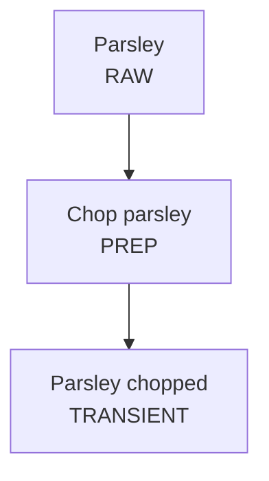

# Recipe Import

Import recipes into the RecipePlanner database safely through the test environment.

## Prerequisites

- Test database running on port 8091 (synced with production)
- Recipe provided by user (ingredients + instructions)

## Workflow

1. **Get recipe** - Ask for name, ingredients, instructions, yield
2. **Create flow diagram** - Analyze recipe, create Mermaid diagram, get user approval
3. **Check products** - Run matching scripts, identify existing vs new products
4. **Create import script** - Hardcode to test database (port 8091)
5. **Run import** - Execute on test database
6. **Verify in UI** - User checks recipe in test database view

## Step 1: Analyze Recipe

Break down the recipe:
- Raw ingredients (purchased items)
- Prep steps (chop, dice, slice, zest - physical processing of raw produce)
- Assembly steps (roast, saute, simmer, mix, combine - cooking/combining ingredients)
- Intermediate products (chopped X, roasted Y)
- Final products (stored vs transient)

## Step 2: Create Mermaid Flow Diagram

**Critical rule**: Products NEVER connect directly to products. Always: Product -> Step -> Product



Save to `examples/[recipe-name]/[recipe-name]-flow.md` and get user confirmation.

## Step 3: Check Existing Products

```bash
cd recipe-planner
node scripts/find-product-matches.js
```

Review matches with user before proceeding.

## Step 4: Create Import Script

Create `recipe-planner/import-[recipe-name].js`:

```javascript
import PocketBase from "pocketbase";

const pb = new PocketBase("http://192.168.50.95:8091"); // TEST ONLY

async function importRecipe() {
  // 1. Create recipe
  const recipe = await pb.collection("recipes").create({
    name: "Recipe Name",
    recipe_type: "meal", // or "batch_prep"
  });

  // 2. Create missing products
  const product = await pb.collection("products").create({
    name: "product name",
    type: "raw", // raw|transient|stored|inventory
    pantry: false,
  });

  // 3. Create product nodes
  const node = await pb.collection("recipe_product_nodes").create({
    recipe: recipe.id,
    product: productId,
    quantity: 0.5,
    unit: "cup",
  });

  // 4. Create steps
  const step = await pb.collection("recipe_steps").create({
    recipe: recipe.id,
    name: "Step description",
    step_type: "prep", // prep|assembly
    timing: "batch", // batch|just_in_time
  });

  // 5. Create edges
  await pb.collection("product_to_step_edges").create({
    recipe: recipe.id,
    source: node.id,
    target: step.id,
  });
  await pb.collection("step_to_product_edges").create({
    recipe: recipe.id,
    source: step.id,
    target: outputNode.id,
  });
}

importRecipe();
```

## Step 5: Run and Verify

```bash
node import-[recipe-name].js
```

User should switch UI to TEST database (green chip) and verify the recipe.

## Product Types

| Type | Description | Examples |
|------|-------------|----------|
| `raw` | Base ingredients | lemon, onion (yellow) |
| `raw` + `pantry: true` | Simple untracked items | olive oil, salt, pepper |
| `inventory` | Compound tracked items | vegetable stock, frozen garlic cubes |
| `transient` | Intermediate or served | parsley chopped, bean mixture |
| `stored` | Made ahead, refrigerated | white bean stew base |

## Naming Conventions

**Raw**: `[ingredient]` or `[ingredient] ([variant])` - lowercase
- `lemon`, `onion (yellow)`, `tomato cherry`

**Transient**: `[ingredient] [action]` - action after noun, past tense
- `parsley chopped`, `tomato cherry roasted`

**Stored**: Descriptive of the prepared component
- `lemon-parsley mixture`, `white bean stew base`

## Step Types

- **`prep`**: Physical processing of raw fruits and vegetables into broken-down variants. Examples: chopping, dicing, slicing, zesting, mincing. These steps transform a raw ingredient into a transient "prepped" product.
- **`assembly`**: Cooking or combining prepped ingredients, inventory items, and pantry items into intermediate or final products. Examples: roasting, sauteing, simmering, mixing, tossing with dressing.

## Step Timing

- **`batch`**: Made ahead on prep day. Use for all prep steps and assembly steps that create stored products.
- **`just_in_time`**: Performed at serving time. Use for final assembly steps and any steps that must be done fresh (e.g., dressing a salad, warming bread).

## Database Reference

See [references/schema.md](references/schema.md) for collection details and field types.

## Example

See `examples/white-bean-stew/` for complete flow diagram example.
