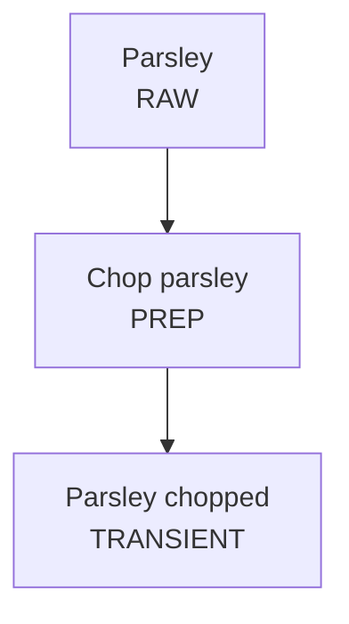

# Recipe Import

Turn a recipe (ingredients + instructions) into the **import-page JSON contract** the
in-app `/import` page accepts. You do the analysis — product reuse, step/timing
conventions, store/section discipline — and hand the user a single JSON object to paste.
The page validates it (never blocks), lands it as a **draft directly in prod**, and
redirects into the RecipeEditor for review/edit. Publishing (the only hard gate) happens
there later.

**This skill emits JSON. It does not generate import scripts, does not touch the test
database, and does not migrate anything to prod.** The old `import-*.js` / `migrate-*.js`
test→prod ritual is retired (IMP-03) — landing and review now happen entirely on the
`/import` page.

## Prerequisites

- Recipe provided by user (name, ingredients, instructions, yield).
- Read access to the product registry to reuse existing products (query prod directly —
  see Step 3). This is READ-ONLY; you never write to the DB from this skill.

## Workflow

1. **Get recipe** — Ask for name, ingredients, instructions, yield, and whether it's a
   `meal` or a `batch_prep`.
2. **Analyze into a graph** — Break the recipe into products (raw / transient / stored /
   inventory) and steps (prep / assembly); sketch the `Product → Step → Product` flow.
3. **Check existing products** — Query the registry to reuse products (avoid near-dupes),
   and capture `store`/`section` for any genuinely new non-pantry product.
4. **Emit the import JSON** — Produce the D-01 `{name + hints}` contract: recipe metadata,
   product lines, steps with full Phase-5 metadata, and `ref`-based edges. Show it to the
   user and confirm.
5. **Hand off to the /import page** — Tell the user to paste the JSON into `/import`. It
   lands a draft and drops them into RecipeEditor. You are done — no scripts run.

## Step 1: Analyze Recipe

Break the recipe down:
- **Raw ingredients** (purchased items).
- **Prep steps** (chop, dice, slice, zest, mince — physical processing of raw produce).
- **Assembly steps** (roast, saute, simmer, mix, combine — cooking/combining).
- **Intermediate products** (chopped X, roasted Y) — `transient`.
- **Final products** — `stored` (made ahead, refrigerated) vs `transient` (served now).

## Step 2: Sketch the Flow (Product → Step → Product)

**Critical rule**: Products NEVER connect directly to products. Always
`Product → Step → Product`. A quick Mermaid sketch is a useful thinking tool (optional,
not part of the emitted JSON):


```mermaid
graph TD
    P1[Parsley<br/>RAW] --> S1[Chop parsley<br/>PREP]
    S1 --> T1[Parsley chopped<br/>TRANSIENT]
```

Every edge in the sketch becomes a `{from, to}` entry in the JSON `edges` array, using the
product/step `ref`s (see Step 4).

## Step 3: Check Existing Products (read-only)

Reuse existing products aggressively — the biggest source of import mess is minting
near-duplicate products. Query the **prod** registry directly (read-only) for each
ingredient you expect to need. Run from inside `recipe-planner/` (its `node_modules`):

```javascript
// One-shot inline node script — READ ONLY. Run from recipe-planner/.
import PocketBase from "pocketbase";
async function main() {
  const pb = new PocketBase("http://192.168.50.95:8090"); // prod, read-only
  const products = await pb.collection("products").getFullList({ sort: "name" });
  for (const term of ["tomato", "onion", "garlic", "paprika"]) {
    console.log(`\n=== ${term} ===`);
    products
      .filter((p) => p.name.toLowerCase().includes(term))
      .forEach((p) => console.log(`  ${p.name} [${p.type}] pantry=${p.pantry} id=${p.id}`));
  }
}
main().catch((e) => console.error("ERROR:", e.message, e.status, e.url));
```

Review matches with the user. When you find an existing product, put its id in the product
line's `matchProductId` hint so the import page auto-links it instead of creating a dupe.

Common reuse opportunities you might miss:
- `crushed red pepper` and `red pepper flakes` are the **same product**.
- An existing transient like `onion (yellow) small-dice` is usually fine for "minced
  onion" — don't create near-duplicates.
- A recipe asking for "garlic" should typically pull from `garlic cubes (frozen)`
  (inventory) via a **`Pull out garlic cubes` assembly step** (not a prep step) producing
  `garlic cube (pulled)` (transient). This applies to any tracked inventory ingredient.
- Distinct varieties (e.g. `paprika smoked` vs `paprika`) should stay separate products.
- **Fresh vs dried herbs are distinct products but the registry may only have one.** If a
  recipe wants dried thyme and only `thyme (fresh)` exists, either reuse `thyme (fresh)`
  (adjust the quantity — the recipe usually gives both) via `matchProductId`, or create a
  new `thyme dried`. Don't leave it to auto-match, which will silently bind fresh→dried.

### Silent auto-match trap (the `red wine` → `red wine vinegar` bug)

The /import page auto-matches a product line to an existing product when the fuzzy score is
≤ 0.15 — and it does this BEFORE showing the user anything, with no prompt. A new raw
product whose name is a substring/near-match of an existing DIFFERENT product gets silently
bound to the wrong one (`"red wine"` matches `"red wine vinegar"` at 0.057). To avoid it:
- If you intend a SPECIFIC existing product, always set `matchProductId` — never rely on
  the auto-matcher to pick.
- If the product is genuinely NEW and a confusable near-match exists in the registry, say
  so explicitly in your handoff ("red wine will auto-match to red wine vinegar — fix it in
  the editor after landing, or I can pre-create it") so the user knows to correct it. There
  is no JSON hint that forces "create new, don't auto-match."

### Store + section hints (REQUIRED for every new non-pantry product)

Every genuinely NEW `raw`, `inventory`, or `stored` product the user actually buys
(`pantry: false`) **must** carry `store` (and, where applicable, `section`) hints in its
product line. These power shopping-list grouping; a product with no store/section quietly
falls out of the list and gets missed at the store (this was the `chives` / `crema` /
`ancho chile` bug in the creamy-tomato-soup import — don't repeat it).

Procedure for a new product:
1. Ask the user (or infer, then confirm) which store sells it and which department/aisle.
2. Look up the ids in the `stores` and `sections` collections (one inline read query, same
   pattern as above), and pass them as `store` / `section` hints on the product line.
   (If you leave the hint as a plain name string, the import page's inline resolution step
   will prompt the user to pick — but resolving it up front is cleaner.)

Rules of thumb:
- **Safeway products**: almost always have a section (`produce`, `dairy`, `meat`,
  `bakery`, `frozen`, `baking supplies`, `international`, `prepared meals`). Don't leave
  section blank for a Safeway item.
- **Online products** (Amazon / specialty): `section` typically left blank — see
  `garam masala`, `kasuri methi`, `parchment paper`. Store still required.
- **Costco / Trader Joes**: store required; section optional and usually omitted.
- **`pantry: true` products**: store/section can be omitted — not in the active list.

Sanity check before emitting: list every product line that will create a NEW product and
confirm each has a `store` hint.

## Step 4: Emit the Import JSON (the D-01 contract)

Produce a single JSON object with `recipe`, `products`, `steps`, and `edges`. This is the
exact contract the `/import` page's `validateImportJson` accepts (it never throws — any
problem is surfaced inline for the user to fix; it can never produce a partial write).

### Shape

```json
{
  "recipe": {
    "name": "Creamy Tomato Soup",
    "notes": "optional human-facing blurb",
    "recipe_type": "batch_prep",
    "status": "draft"
  },
  "tags": [],
  "products": [
    {
      "ref": "product-1",
      "name": "onion (yellow)",
      "unit": "cup",
      "quantity": 0.5,
      "matchProductId": "10x87sv01ut8xa7"
    },
    {
      "ref": "product-2",
      "name": "ancho chile",
      "unit": "each",
      "quantity": 2,
      "productType": "raw",
      "pantry": false,
      "store": "STORE_ID_OR_NAME",
      "section": "SECTION_ID_OR_NAME"
    },
    { "ref": "product-3", "name": "onion diced", "unit": "cup" }
  ],
  "steps": [
    {
      "ref": "step-1",
      "name": "Dice onion",
      "step_type": "prep",
      "timing": "batch",
      "active_minutes": 5,
      "passive_minutes": 0,
      "prep_action": "dice",
      "instructions": "Small-dice the yellow onion."
    }
  ],
  "edges": [
    { "from": "product-1", "to": "step-1" },
    { "from": "step-1", "to": "product-3" }
  ]
}
```

### Rules

- **`ref`s** follow the `product-*` / `step-*` convention (mirrors RecipeEditor's local
  node ids, so the import id-remap ports unchanged). Every product and step needs a unique
  `ref`. If you omit `ref`, the validator assigns `product-<n>` / `step-<n>` by position —
  but assign them explicitly so your edges are readable.
- **Product lines** require `name` + `unit`. Put `quantity` on raw inputs and stored
  outputs; transient/intermediate nodes usually omit quantity.
- **Hints** (all optional): `matchProductId` (reuse an existing product by id — strongly
  preferred over creating a dupe), `productType` (`raw` | `transient` | `stored` |
  `inventory`), `pantry` (bool), `fdcId` (USDA FDC id), `store`, `section`.
- **Steps** require `name` + `step_type` (`prep` | `assembly`). Carry the full Phase-5
  metadata where known: `timing` (`batch` | `just_in_time`), `active_minutes`,
  `passive_minutes`, `instructions`, `prep_action`, `resource`, `oven_temp_f`,
  `rack_slots`. (See references/schema.md for the enum values and field meanings.)
- **Edges** are `{ "from": ref, "to": ref }`. Direction is inferred from the ref prefix:
  `product-* → step-*` is an input; `step-* → product-*` is an output. NEVER
  `product → product`.
- **`recipe.status`**: set `"draft"` (the import page lands drafts). It's the default even
  if omitted.
- Unknown `timing`/`resource` enum values are normalized to `undefined` with a warning by
  the validator — not a hard error. Prefer the documented enum values.

Show the JSON to the user and confirm before handing off. This is the confirm-before-write
step (nothing has been written yet — the page writes on paste).

### Deliver the JSON as a FILE, not just an inline block (copy-safety)

The /import page's `validateImportJson` is total and won't throw, but it parses **the exact
text the user pastes** — and copying a large JSON out of a chat/terminal code block reliably
corrupts it: hard newlines get inserted mid-string at the wrap column, straight quotes get
"smartened" to curly quotes (`"` → `"` `"`), and long blocks get silently truncated. Any of
these makes the paste fail. **Always write the emitted JSON to a real `.json` file and hand
that file to the user** so they can open it in an editor and copy clean text (or paste the
file), rather than relying on the rendered code block. Show the JSON inline for review, but
the file is the artifact they actually import from.

Practical rule:
1. Write the object to a `.json` file (pretty-printed, ASCII quotes only — no smart quotes,
   no `…` ellipsis, no en/em-dashes inside string values; keep instructions plain ASCII).
2. Deliver that file to the user (the inline block is for eyeballing only).
3. Before delivering, sanity-check the file structurally: it `JSON.parse`s; every `ref` is
   unique; every product line has `name` + `unit`; every step has `name` + `step_type`;
   every edge's `from`/`to` resolves and runs product↔step (never product→product); every
   step has ≥1 inbound and ≥1 outbound edge. Also list every line that will create a NEW
   product (no `matchProductId`) and confirm each buyable one carries a `store` hint.
4. **Validate every SELECT value against the real schema enums** (the #1 real-world import
   failure): `recipe.recipe_type ∈ {meal, batch_prep}`; each step's
   `step_type ∈ {prep, assembly}`, `timing ∈ {batch, just_in_time}`,
   `prep_action ∈ {sliced, diced, minced, chopped, grated, shredded}`,
   `resource ∈ {oven, stovetop, blender, food_processor, instant_pot, microwave, sous_vide,
   smoker, none}`. A bad `prep_action`/`step_type`/`recipe_type` is a HARD 400 that fails
   the whole import (only `timing`/`resource` soft-normalize). Grep the schema mirror
   (`pb_schema.json`) for the live `values=[...]` if unsure — don't trust memory.

## Step 5: Hand off to the /import page

Tell the user:

> Open the JSON **file** I handed you (don't copy from the chat code block — that introduces
> line-wrap/smart-quote artifacts that fail the paste), copy its contents, and paste into the
> **/import** page in the app and submit. It will validate the graph, land it as a **draft**
> directly in prod, and drop you into the recipe editor for review. Any unmatched products
> get an inline resolution prompt (pick existing / quick-create / USDA) before the draft
> finishes landing. When you're happy, hit **Publish** in the editor — that's the only step
> that runs the linter.

You are done. Do not run any import or migration script.

## Product Types

| Type | Description | Examples |
|------|-------------|----------|
| `raw` | Base ingredients | lemon, onion (yellow) |
| `raw` + `pantry: true` | Simple untracked items | olive oil, salt, pepper |
| `inventory` | Compound tracked items | vegetable stock, frozen garlic cubes |
| `transient` | Intermediate or served | parsley chopped, bean mixture |
| `stored` | Made ahead, refrigerated | white bean stew base |

## Naming Conventions

**Raw**: `[ingredient]` or `[ingredient] ([variant])` — lowercase
- `lemon`, `onion (yellow)`, `tomato cherry`

**Transient**: `[ingredient] [action]` — action after noun, past tense
- `parsley chopped`, `tomato cherry roasted`

**Stored**: Descriptive of the prepared component
- `lemon-parsley mixture`, `white bean stew base`

## Step Types

- **`prep`**: Physical processing of raw fruits and vegetables into broken-down variants
  (chopping, dicing, slicing, zesting, mincing). Transforms a raw ingredient into a
  transient "prepped" product.
- **`assembly`**: Cooking or combining prepped ingredients, inventory items, and pantry
  items into intermediate or final products (roasting, sauteing, simmering, mixing,
  tossing with dressing).

### `prep_action` is a SELECT — past-tense, fixed vocabulary

`prep_action` is NOT free text. Its only legal values (past-tense) are:
**`sliced`, `diced`, `minced`, `chopped`, `grated`, `shredded`**. A present-tense verb
(`dice`, `chop`, `slice`) or anything off-list is a HARD import failure — PB returns a
generic "Failed to create record." and the whole draft fails to land (unlike
`timing`/`resource`, which soft-normalize with a warning). Use it only on genuine
knife-prep steps; **omit the key entirely** for non-knife steps (pull, cook, toast,
simmer, serve). `step_type` (`prep`|`assembly`) and `timing` (`batch`|`just_in_time`) are
likewise selects — emit the exact enum strings from `references/schema.md`.

## Step Timing

- **`batch`**: Made ahead on prep day. Use for all prep steps and assembly steps that
  create stored products.
- **`just_in_time`**: Performed at serving time. Use for final assembly steps and anything
  that must be done fresh (dressing a salad, warming bread).

## Database Reference

See [references/schema.md](references/schema.md) for collection details, field types, and
the Phase-5 `recipe_steps` metadata fields (`active_minutes`, `passive_minutes`,
`instructions`, `prep_action`, `resource`, `oven_temp_f`, `rack_slots`) and the
`recipes.status` lifecycle field.

## Common Gotchas

- **Emit JSON, not a script.** The deliverable is the D-01 contract for the /import page.
  If you catch yourself writing `pb.collection(...).create(...)` to land a recipe, stop —
  that path is retired. The only DB access this skill makes is the READ-ONLY product
  lookup in Step 3.
- **Reuse products via `matchProductId`.** When Step 3 finds an existing product, always
  put its id in the line's `matchProductId` hint. Bare `name`-only lines force the import
  page to match/create, risking a near-duplicate.
- **Store/section on every new non-pantry product** — omit them and the product drops out
  of the shopping list.
- **Hand off the JSON as a FILE.** Copying a large JSON out of a chat/terminal code block
  corrupts it (mid-string line-wraps, straight→curly quotes, silent truncation) and the
  paste fails. Write it to a `.json` file (plain ASCII — no smart quotes / ellipsis / fancy
  dashes in string values) and deliver that; the inline block is for review only. See
  Step 4 "Deliver the JSON as a FILE."
- **Top-level `await` + pocketbase errors** (for the Step 3 read query): an unhandled
  rejection prints the entire pocketbase ESM bundle (~20K chars of minified code). Always
  wrap the read in `async function main()` + `main().catch((e) => console.error("ERROR:",
  e.message, e.status, e.url))`.
- **Node module resolution**: the Step 3 read script must live inside `recipe-planner/`
  (alongside its `node_modules`) or it fails with `ERR_MODULE_NOT_FOUND`.

## Maintenance Scripts (registry-hygiene, still useful)

- `scripts/find-product-matches.js` — quick category-bucketed product list; supplement
  with direct reads (Step 3).
- `scripts/find-duplicates.js` — exact + near-duplicate detection across products.

The old per-recipe `import-*.js` and `migrate-*.js` scripts, and the `sync-to-test.js` /
`compare-product-ids.js` promote-ritual helpers, are no longer part of the import flow
(the test DB is for schema/code changes only now). Do not create new ones.

## Example

See `examples/white-bean-stew/` for a complete flow-diagram example,
`examples/mushroom-shawarma-pitas/` for a meal-with-stored-component pattern, and
`examples/creamy-tomato-soup/` for an inventory-as-ingredient (frozen garlic cubes)
pattern. Translate the flow diagram into the JSON `products`/`steps`/`edges` arrays as
shown in Step 4.
