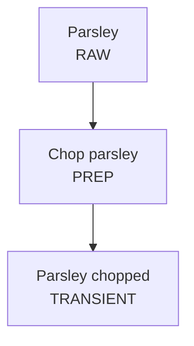

# Recipe Import

Import recipes into the RecipePlanner database safely through the test environment.

## Prerequisites

- Test database running on port 8091 (synced with production)
- Recipe provided by user (ingredients + instructions)

## Workflow

1. **Get recipe** - Ask for name, ingredients, instructions, yield
2. **Create flow diagram** - Analyze recipe, create Mermaid diagram, get user approval
3. **Check products** - Query test DB directly for matches, identify existing vs new products
4. **Create import script** - Hardcode to test database (port 8091)
5. **Run import** - Execute on test database
6. **Verify in UI** - User checks recipe in test database view
7. **Promote to prod** - When user approves, migrate recipe (and any weekly plan) to prod database

## Step 1: Analyze Recipe

Break down the recipe:
- Raw ingredients (purchased items)
- Prep steps (chop, dice, slice, zest - physical processing of raw produce)
- Assembly steps (roast, saute, simmer, mix, combine - cooking/combining ingredients)
- Intermediate products (chopped X, roasted Y)
- Final products (stored vs transient)

## Step 2: Create Mermaid Flow Diagram

**Critical rule**: Products NEVER connect directly to products. Always: Product -> Step -> Product


```mermaid
graph TD
    P1[Parsley<br/>RAW] --> S1[Chop parsley<br/>PREP]
    S1 --> T1[Parsley chopped<br/>TRANSIENT]
```

Save to `examples/[recipe-name]/[recipe-name]-flow.md` and get user confirmation.

## Step 3: Check Existing Products

The repo has `scripts/find-product-matches.js` with hardcoded categories — useful as a first pass but rarely complete for a new recipe. **Prefer querying the test DB directly** for each ingredient you expect to need:

```javascript
// One-shot inline node script — run from recipe-planner/ directory
import PocketBase from "pocketbase";
async function main() {
  const pb = new PocketBase("http://192.168.50.95:8091");
  const products = await pb.collection("products").getFullList({ sort: "name" });
  for (const term of ["tomato", "onion", "garlic", "paprika"]) {
    console.log(`\n=== ${term} ===`);
    products
      .filter((p) => p.name.toLowerCase().includes(term))
      .forEach((p) => console.log(`  ${p.name} [${p.type}] pantry=${p.pantry} id=${p.id}`));
  }
}
main().catch((e) => console.error("ERROR:", e.message, e.status, e.url));
```

Review matches with user. Common reuse opportunities you might miss:
- `crushed red pepper` and `red pepper flakes` are the **same product**.
- An existing transient like `onion (yellow) small-dice` is usually fine for "minced onion" — don't create near-duplicates.
- A recipe asking for "garlic" should typically pull from `garlic cubes (frozen)` (inventory) via a **`Pull out garlic cubes` assembly step** (not a prep step) producing `garlic cube (pulled)` (transient). This applies to any tracked inventory ingredient.
- Distinct varieties (e.g. `paprika smoked` vs `paprika`) should stay as separate products.

## Step 4: Create Import Script

Create `recipe-planner/import-[recipe-name].js`. Keep existing product IDs in an `existing` const, create new products inline, then merge into a single `products` map for clarity. Use a `for` loop when many sources flow into the same step.

```javascript
import PocketBase from "pocketbase";

const pb = new PocketBase("http://192.168.50.95:8091"); // TEST ONLY

async function importRecipe() {
  // 1. Create recipe
  const recipe = await pb.collection("recipes").create({
    name: "Recipe Name",
    recipe_type: "meal", // or "batch_prep"
  });

  // 2. Existing product IDs (from test DB lookup)
  const existing = {
    onionYellow: "10x87sv01ut8xa7",
    salt: "9iane0ye82u9d1m",
    // ...
  };

  // 3. Create new products
  const newProduct = await pb.collection("products").create({
    name: "product name",
    type: "raw", // raw|transient|stored|inventory
    pantry: false,
  });

  const products = { ...existing, newProduct: newProduct.id };

  // 4. Create product nodes (pass quantity/unit only on raw inputs and stored outputs)
  const node = await pb.collection("recipe_product_nodes").create({
    recipe: recipe.id,
    product: products.onionYellow,
    quantity: 0.5,
    unit: "cup",
  });

  // 5. Create steps
  const step = await pb.collection("recipe_steps").create({
    recipe: recipe.id,
    name: "Step description",
    step_type: "prep", // prep|assembly
    timing: "batch", // batch|just_in_time
  });

  // 6. Create edges — fan-in pattern for steps with many inputs
  for (const src of [node.id /*, ...other input node ids */]) {
    await pb.collection("product_to_step_edges").create({
      recipe: recipe.id,
      source: src,
      target: step.id,
    });
  }
  await pb.collection("step_to_product_edges").create({
    recipe: recipe.id,
    source: step.id,
    target: outputNode.id,
  });
}

importRecipe().catch(console.error);
```

## Step 5: Run and Verify

```bash
cd recipe-planner
node import-[recipe-name].js
```

User should switch UI to TEST database (green chip) and verify the recipe.

## Step 6: Promote to Production

After user approves the recipe in test, migrate to prod. The migration is structurally the same for any recipe — copy `recipe` + `recipe_tags` + `recipe_product_nodes` + `recipe_steps` + `product_to_step_edges` + `step_to_product_edges`, mapping product IDs by ID-first then name fallback.

If the user also planned a week that includes the new recipe, migrate `weekly_plans` + `planned_meals` for that plan in the same script.

Pattern (write a one-off `scripts/migrate-[thing].js`, then **delete it after running** — it's specific to one recipe/plan):

```javascript
import PocketBase from "pocketbase";
const pbTest = new PocketBase("http://192.168.50.95:8091");
const pbProd = new PocketBase("http://192.168.50.95:8090");

const RECIPE_IDS = ["..."]; // recipe(s) to migrate
const PLAN_ID = "...";       // optional weekly plan to migrate

function strip(record) {
  const { created, updated, collectionId, collectionName, expand, ...data } = record;
  return data;
}

// 1) Build product ID map: ID-match first, name-match fallback, create otherwise.
//    Carry test ID to prod when creating, so future migrations match by ID.
// 2) For each recipe: upsert recipe, recipe_tags, nodes, steps, edges.
//    Use the productIdMap when copying nodes; preserve node/step IDs across DBs.
// 3) For the weekly plan (if any): upsert weekly_plan and all planned_meals.
//
// See `scripts/migrate-recipes-to-prod.js` (older) and `scripts/migrate-tomato-soup-and-week.js`
// (newer, includes weekly plan support) for full reference implementations.

async function main() {
  // ... see reference implementations
}

main().catch((e) => {
  console.error("ERROR:", e.message, e.status, e.url);
  if (e.response?.data) console.error("response:", JSON.stringify(e.response.data, null, 2));
  process.exit(1);
});
```

**Pre-flight check before migrating a weekly plan**: every recipe referenced by a `planned_meals` row must already exist in prod (by ID). Verify by querying prod for each unique recipe ID; create any missing ones first.

**Cleanup**: after a successful one-off migration runs, delete the script. Don't leave hardcoded RECIPE_IDS/PLAN_ID files lying around — git history is the audit trail.

## Product Types

| Type | Description | Examples |
|------|-------------|----------|
| `raw` | Base ingredients | lemon, onion (yellow) |
| `raw` + `pantry: true` | Simple untracked items | olive oil, salt, pepper |
| `inventory` | Compound tracked items | vegetable stock, frozen garlic cubes |
| `transient` | Intermediate or served | parsley chopped, bean mixture |
| `stored` | Made ahead, refrigerated | white bean stew base |

## Naming Conventions

**Raw**: `[ingredient]` or `[ingredient] ([variant])` - lowercase
- `lemon`, `onion (yellow)`, `tomato cherry`

**Transient**: `[ingredient] [action]` - action after noun, past tense
- `parsley chopped`, `tomato cherry roasted`

**Stored**: Descriptive of the prepared component
- `lemon-parsley mixture`, `white bean stew base`

## Step Types

- **`prep`**: Physical processing of raw fruits and vegetables into broken-down variants. Examples: chopping, dicing, slicing, zesting, mincing. These steps transform a raw ingredient into a transient "prepped" product.
- **`assembly`**: Cooking or combining prepped ingredients, inventory items, and pantry items into intermediate or final products. Examples: roasting, sauteing, simmering, mixing, tossing with dressing.

## Step Timing

- **`batch`**: Made ahead on prep day. Use for all prep steps and assembly steps that create stored products.
- **`just_in_time`**: Performed at serving time. Use for final assembly steps and any steps that must be done fresh (e.g., dressing a salad, warming bread).

## Database Reference

See [references/schema.md](references/schema.md) for collection details and field types.

## Common Gotchas

- **Top-level `await` + pocketbase errors**: an unhandled rejection prints the entire pocketbase ESM bundle (~20K characters of minified code), drowning out the actual error. Always wrap script bodies in `async function main()` and use `main().catch((e) => console.error("ERROR:", e.message, e.status, e.url))`. Optionally also dump `e.response?.data` as JSON for the server's validation message.
- **Node module resolution**: scripts that `import "pocketbase"` must live inside `recipe-planner/` (alongside its `node_modules`). Putting them in `/tmp/` or a parent directory will fail with `ERR_MODULE_NOT_FOUND`.
- **`weekly_plans` has no `created` field**: sorting by `created` returns 400. Use `getFullList()` without `sort`, or sort client-side.
- **Test DB drift**: prod IDs and test IDs are intended to match (see `scripts/sync-to-test.js`), but newly created products on the test side won't be in prod until migration carries the test ID over. Migration scripts must check ID first, then name, then create.

## Maintenance Scripts (keep these)

- `scripts/sync-to-test.js` — copy prod → test, preserving IDs. Run when test diverges or before importing a fresh recipe.
- `scripts/find-product-matches.js` — quick category-bucketed product list. Hardcoded categories; supplement with direct DB queries (see Step 3).
- `scripts/find-duplicates.js` — exact + near-duplicate detection across products.
- `scripts/compare-product-ids.js` — verify prod/test ID alignment before any migration.

One-off `import-*.js` and `migrate-*.js` scripts should be deleted after they run — git history preserves them as references.

## Example

See `examples/white-bean-stew/` for complete flow diagram example, `examples/mushroom-shawarma-pitas/` for a meal-with-stored-component pattern, and `examples/creamy-tomato-soup/` for an inventory-as-ingredient (frozen garlic cubes) pattern.
