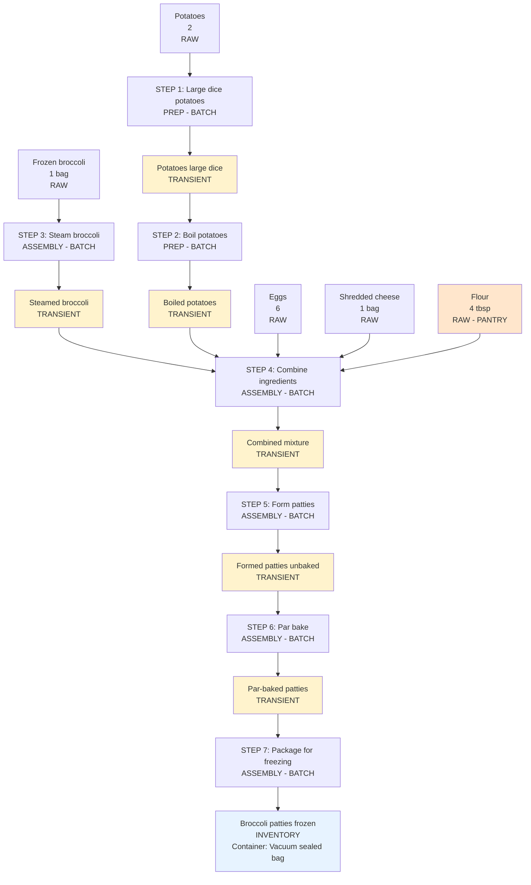

# Broccoli Patties - Recipe Flow

## Recipe Details

**Recipe Name**: Broccoli Patties  
**Recipe Type**: batch_prep (creates inventory item)  
**Yield**: Multiple patties for freezing

---

## Proposed Flow Structure

### Raw Ingredients
1. **Frozen broccoli** - 1 bag (raw, from Safeway frozen section)
2. **Eggs** - 6 (raw)
3. **Potatoes** - 2 (raw)
4. **Shredded cheese** - 1 bag (raw)
5. **Flour** - 4 tbsp (raw, pantry)

### Prep Steps (Processing Raw Ingredients)

1. **Large dice potatoes** (prep, batch)
2. **Boil potatoes** (prep, batch)

### Assembly Steps (Combining & Forming)

3. **Steam broccoli** (assembly, batch)
4. **Combine ingredients** (assembly, batch)
5. **Form patties** (assembly, batch)
6. **Par bake patties** (assembly, batch)
7. **Package for freezing** (assembly, batch)

### Intermediate Products (Transient)

- Diced potatoes (large dice)
- Boiled potatoes
- Steamed broccoli
- Combined mixture
- Formed patties (unbaked)
- Par-baked patties

### Final Product (Inventory)

- **Broccoli patties (frozen)** - inventory type
  - Container: Vacuum sealed bag
  - Tracked in inventory system
  - Ready to use in meals

**Note**: Steps 1-2 are PREP (processing raw ingredients). Steps 3-7 are ASSEMBLY (combining/forming).

---

## Mermaid Flow Diagram

## Legend
- **Orange** = Pantry items (not tracked)
- **White** = Raw ingredients
- **Blue** = Inventory items (final product - tracked)
- **Yellow** = Transient intermediate products

## Summary

**Total Products**:
- 5 raw ingredients (1 pantry, 4 regular)
- 6 transient intermediates
- 1 inventory final product
- **Total: 12 product nodes**

**Total Steps**: 7 steps (2 PREP + 5 ASSEMBLY)
**Total Edges**: 18 edges (13 product→step + 5 step→product... wait, let me recount)

Actually: 14 edges total (11 product→step inputs + 7 step→product outputs = 18 edges)

**Container Type**: Vacuum sealed bag (need to verify this container type exists)

**Ready for product matching?** Confirm this flow is correct!
