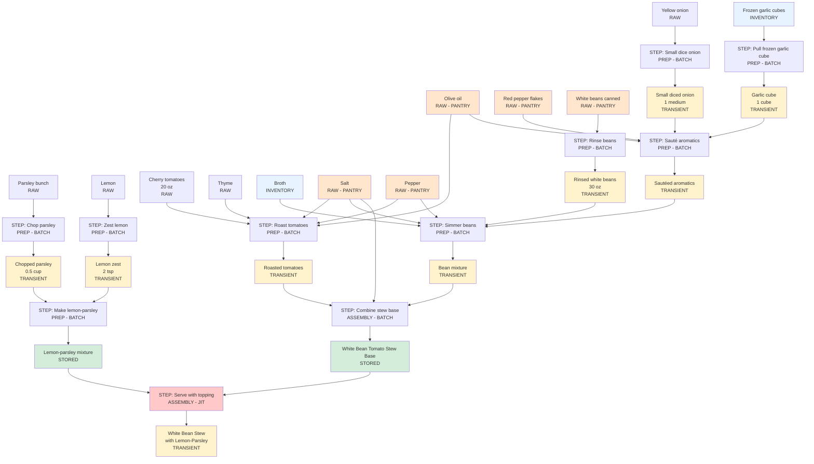

# White Bean and Tomato Stew - Recipe Flow (Detailed with Prep Steps)

## Mermaid Graph

## Legend
- **Orange** = Pantry items (RAW - simple ingredients not tracked)
- **White** = Fresh raw ingredients
- **Blue** = Inventory items (compound components tracked in inventory)
- **Yellow** = Transient products (prep intermediates, cooking intermediates, or final served dish)
- **Green** = Stored products (made ahead and stored)
- **Pink/Red** = Just-in-time steps (performed at serving time)

## Flow Explanation

**PREP STEPS (Ingredient Processing):**
- Parsley bunch → Chop parsley → Chopped parsley (0.5 cup)
- Lemon → Zest lemon → Lemon zest (2 tsp)
- Yellow onion → Small dice onion → Diced onion (1 medium)
- Frozen garlic cubes (INVENTORY) → Pull frozen garlic cube → Garlic cube (1 cube)
- Canned beans → Rinse beans → Rinsed beans (30 oz)

**BATCH PREP (Main Steps 1-5):**
1. Make lemon-parsley mixture → Store it
2. Roast tomatoes with oil, thyme, S&P → Transient
3. Sauté diced onion, garlic cube, red pepper flakes in oil → Transient
4. Simmer sautéed aromatics with rinsed beans and broth → Transient
5. Combine bean mixture with roasted tomatoes → Store it

**JUST-IN-TIME (Step 6):**
6. Take stored stew base + stored lemon-parsley → Serve

## Summary

**Total Products**: 
- 12 base ingredients (5 pantry, 2 inventory, 5 fresh raw)
- 5 prepped transient ingredients
- 3 cooking transient intermediates
- 2 stored products
- 1 final served transient
- **Total: 23 product nodes**

**Total Steps**: 11 steps (5 prep + 5 batch main + 1 JIT assembly)
**Total Edges**: 38 edges (28 product→step + 10 step→product)

## Ready for Import?
This flow now correctly represents frozen garlic cubes from inventory. Confirm this is correct, and I'll create the import script!
