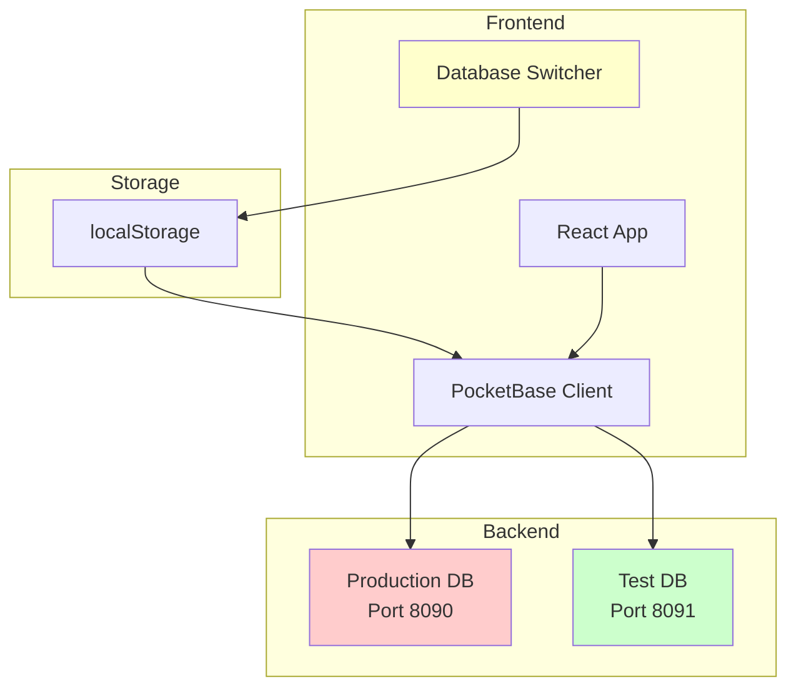

# Test Database Environment Setup Plan

## Overview
Set up a parallel test database environment to safely test recipe imports and other data operations without affecting the production database.

## Architecture

### Database Instances
```
Production PocketBase:  http://192.168.50.95:8090
Test PocketBase:        http://192.168.50.95:8091
```

### Component Diagram


## Requirements Breakdown

### 1. Frontend Database Switcher UI

#### Location
Add to [`Layout.tsx`](recipe-planner/src/components/Layout.tsx) in the AppBar Toolbar (top-right area)

#### Design Specifications
- **Visual Indicator**: Chip or badge showing current database
  - Production: Red/orange color with "PROD" label
  - Test: Green color with "TEST" label
- **Switcher Control**: IconButton with dropdown menu or toggle
- **Placement**: Right side of AppBar, before any other controls
- **Responsive**: Show abbreviated label on mobile

#### User Experience
1. Clear visual indication of which database is active
2. Confirmation dialog when switching to production
3. Toast notification on successful switch
4. Automatic page refresh to ensure clean state
5. Persist selection across sessions

### 2. Configuration Management

#### Environment Variables
Update [`recipe-planner/.env`](recipe-planner/.env):
```env
VITE_POCKETBASE_URL_PROD=http://192.168.50.95:8090
VITE_POCKETBASE_URL_TEST=http://192.168.50.95:8091
VITE_POCKETBASE_DEFAULT=prod
```

#### Database Configuration
Create [`recipe-planner/src/lib/db-config.ts`](recipe-planner/src/lib/db-config.ts):
```typescript
export const DB_ENVIRONMENTS = {
  production: {
    url: import.meta.env.VITE_POCKETBASE_URL_PROD,
    label: 'Production',
    color: '#f44336', // red
    shortLabel: 'PROD'
  },
  test: {
    url: import.meta.env.VITE_POCKETBASE_URL_TEST,
    label: 'Test',
    color: '#4caf50', // green
    shortLabel: 'TEST'
  }
} as const;

export type DbEnvironment = keyof typeof DB_ENVIRONMENTS;

export const DEFAULT_ENV: DbEnvironment = 
  (import.meta.env.VITE_POCKETBASE_DEFAULT as DbEnvironment) || 'production';
```

### 3. PocketBase Client Updates

#### Refactor [`recipe-planner/src/lib/pocketbase.ts`](recipe-planner/src/lib/pocketbase.ts)
Make the PocketBase instance switchable:
```typescript
import PocketBase from 'pocketbase';
import { DB_ENVIRONMENTS, DEFAULT_ENV, type DbEnvironment } from './db-config';

const STORAGE_KEY = 'recipeplannerDbEnvironment';

// Get current environment from localStorage
export function getCurrentEnvironment(): DbEnvironment {
  const stored = localStorage.getItem(STORAGE_KEY);
  return (stored as DbEnvironment) || DEFAULT_ENV;
}

// Set current environment in localStorage
export function setCurrentEnvironment(env: DbEnvironment): void {
  localStorage.setItem(STORAGE_KEY, env);
}

// Get URL for current environment
export function getCurrentDbUrl(): string {
  const env = getCurrentEnvironment();
  return DB_ENVIRONMENTS[env].url;
}

// Create initial PocketBase instance
export let pb = new PocketBase(getCurrentDbUrl());
pb.autoCancellation(false);

// Function to switch database connection
export function switchDatabase(env: DbEnvironment): void {
  setCurrentEnvironment(env);
  const newUrl = DB_ENVIRONMENTS[env].url;
  
  // Create new PocketBase instance with new URL
  pb = new PocketBase(newUrl);
  pb.autoCancellation(false);
  
  // Reload the page to ensure clean state
  window.location.reload();
}
```

### 4. Database Switcher Component

#### Create [`recipe-planner/src/components/DatabaseSwitcher.tsx`](recipe-planner/src/components/DatabaseSwitcher.tsx)
```typescript
import { useState } from 'react';
import {
  Box,
  Chip,
  Menu,
  MenuItem,
  Dialog,
  DialogTitle,
  DialogContent,
  DialogActions,
  Button,
  Typography,
  Alert,
} from '@mui/material';
import { Database as DatabaseIcon, Warning } from '@mui/icons-material';
import { 
  getCurrentEnvironment, 
  switchDatabase, 
  DB_ENVIRONMENTS,
  type DbEnvironment 
} from '../lib/db-config';

export default function DatabaseSwitcher() {
  const currentEnv = getCurrentEnvironment();
  const [anchorEl, setAnchorEl] = useState<null | HTMLElement>(null);
  const [confirmDialogOpen, setConfirmDialogOpen] = useState(false);
  const [targetEnv, setTargetEnv] = useState<DbEnvironment | null>(null);

  const handleClick = (event: React.MouseEvent<HTMLElement>) => {
    setAnchorEl(event.currentTarget);
  };

  const handleClose = () => {
    setAnchorEl(null);
  };

  const handleEnvironmentSelect = (env: DbEnvironment) => {
    handleClose();
    
    // Warn when switching to production
    if (env === 'production') {
      setTargetEnv(env);
      setConfirmDialogOpen(true);
    } else {
      switchDatabase(env);
    }
  };

  const handleConfirmSwitch = () => {
    if (targetEnv) {
      switchDatabase(targetEnv);
    }
    setConfirmDialogOpen(false);
  };

  const config = DB_ENVIRONMENTS[currentEnv];

  return (
    <>
      <Chip
        icon={<DatabaseIcon />}
        label={config.shortLabel}
        onClick={handleClick}
        sx={{
          backgroundColor: config.color,
          color: 'white',
          fontWeight: 'bold',
          cursor: 'pointer',
          '&:hover': {
            opacity: 0.9,
          },
        }}
      />

      <Menu
        anchorEl={anchorEl}
        open={Boolean(anchorEl)}
        onClose={handleClose}
      >
        <Box sx={{ px: 2, py: 1, minWidth: 200 }}>
          <Typography variant="caption" color="text.secondary">
            Select Database:
          </Typography>
        </Box>
        {(Object.keys(DB_ENVIRONMENTS) as DbEnvironment[]).map((env) => (
          <MenuItem
            key={env}
            onClick={() => handleEnvironmentSelect(env)}
            selected={env === currentEnv}
          >
            <Box sx={{ display: 'flex', alignItems: 'center', gap: 1 }}>
              <Box
                sx={{
                  width: 12,
                  height: 12,
                  borderRadius: '50%',
                  backgroundColor: DB_ENVIRONMENTS[env].color,
                }}
              />
              {DB_ENVIRONMENTS[env].label}
            </Box>
          </MenuItem>
        ))}
      </Menu>

      <Dialog open={confirmDialogOpen} onClose={() => setConfirmDialogOpen(false)}>
        <DialogTitle>
          <Box sx={{ display: 'flex', alignItems: 'center', gap: 1 }}>
            <Warning color="warning" />
            Switch to Production Database?
          </Box>
        </DialogTitle>
        <DialogContent>
          <Alert severity="warning" sx={{ mb: 2 }}>
            You are about to switch to the PRODUCTION database.
          </Alert>
          <Typography>
            Any changes you make will affect real data. Make sure you've tested
            your changes on the test database first.
          </Typography>
        </DialogContent>
        <DialogActions>
          <Button onClick={() => setConfirmDialogOpen(false)}>
            Cancel
          </Button>
          <Button onClick={handleConfirmSwitch} variant="contained" color="warning">
            Switch to Production
          </Button>
        </DialogActions>
      </Dialog>
    </>
  );
}
```

### 5. Layout Integration

#### Update [`recipe-planner/src/components/Layout.tsx`](recipe-planner/src/components/Layout.tsx)
Add DatabaseSwitcher to the AppBar:
- Import: `import DatabaseSwitcher from './DatabaseSwitcher';`
- Place in Toolbar, right side: `<Box sx={{ marginLeft: 'auto' }}><DatabaseSwitcher /></Box>`

### 6. Test Database Setup

#### Server-Side Setup (Manual Steps)
1. **Install second PocketBase instance**:
   ```bash
   # On server at 192.168.50.95
   cd /path/to/pocketbase-test
   # Download PocketBase if not already present
   # Run on port 8091
   ./pocketbase serve --http=192.168.50.95:8091
   ```

2. **Create systemd service** (optional, for persistence):
   ```ini
   # /etc/systemd/system/pocketbase-test.service
   [Unit]
   Description=PocketBase Test Database
   After=network.target
   
   [Service]
   Type=simple
   User=youruser
   WorkingDirectory=/path/to/pocketbase-test
   ExecStart=/path/to/pocketbase-test/pocketbase serve --http=192.168.50.95:8091
   Restart=always
   
   [Install]
   WantedBy=multi-user.target
   ```

### 7. Data Sync Strategy

#### Create [`recipe-planner/sync-to-test.js`](recipe-planner/sync-to-test.js)
Script to copy production data to test database:
```javascript
#!/usr/bin/env node

import PocketBase from 'pocketbase';
import fs from 'fs';
import path from 'path';

const PROD_URL = 'http://192.168.50.95:8090';
const TEST_URL = 'http://192.168.50.95:8091';

const collections = [
  'stores',
  'sections',
  'container_types',
  'tags',
  'products',
  'recipes',
  'recipe_tags',
  'recipe_product_nodes',
  'recipe_steps',
  'product_to_step_edges',
  'step_to_product_edges',
  'weekly_plans',
  'planned_meals',
  'inventory_items',
  'meal_variant_overrides',
];

async function syncDatabase() {
  console.log('🔄 Starting database sync: Production → Test\n');
  
  const prodPb = new PocketBase(PROD_URL);
  const testPb = new PocketBase(TEST_URL);
  
  let totalRecords = 0;
  
  for (const collection of collections) {
    try {
      console.log(`📦 Syncing collection: ${collection}`);
      
      // Get all records from production
      const records = await prodPb.collection(collection).getFullList();
      console.log(`  → Found ${records.length} records`);
      
      if (records.length === 0) {
        console.log(`  ✓ Skipped (empty)\n`);
        continue;
      }
      
      // Clear test collection first
      const existingRecords = await testPb.collection(collection).getFullList();
      for (const record of existingRecords) {
        await testPb.collection(collection).delete(record.id);
      }
      console.log(`  → Cleared ${existingRecords.length} existing test records`);
      
      // Copy records to test
      let copied = 0;
      for (const record of records) {
        try {
          // Remove system fields
          const { collectionId, collectionName, created, updated, ...data } = record;
          
          // Create with same ID to preserve relationships
          await testPb.collection(collection).create({
            ...data,
            id: record.id,
          });
          copied++;
        } catch (error) {
          console.error(`  ⚠️  Failed to copy record ${record.id}:`, error.message);
        }
      }
      
      console.log(`  ✓ Copied ${copied} records\n`);
      totalRecords += copied;
      
    } catch (error) {
      console.error(`  ❌ Error syncing ${collection}:`, error.message, '\n');
    }
  }
  
  console.log('================================================================================');
  console.log(`✨ Sync Complete! Copied ${totalRecords} total records`);
  console.log('================================================================================');
  console.log('Test database is now ready for testing.');
  console.log('Switch to test database in the UI and verify the data.\n');
}

syncDatabase().catch(console.error);
```

#### Add sync command to [`recipe-planner/package.json`](recipe-planner/package.json):
```json
{
  "scripts": {
    "sync-to-test": "node sync-to-test.js"
  }
}
```

### 8. Import Script Updates

#### Update Import Scripts to Use Environment Variable
Modify [`recipe-planner/import-white-bean-stew.js`](recipe-planner/import-white-bean-stew.js):
```javascript
import PocketBase from "pocketbase";
import * as dotenv from 'dotenv';

// Load environment variables
dotenv.config();

// Use test database by default for imports
const DB_URL = process.env.IMPORT_DB_URL || process.env.VITE_POCKETBASE_URL_TEST || 'http://192.168.50.95:8091';

console.log(`📍 Using database: ${DB_URL}\n`);
const pb = new PocketBase(DB_URL);

// ... rest of import script
```

#### Create Import Helper Script
[`recipe-planner/run-import.sh`](recipe-planner/run-import.sh):
```bash
#!/bin/bash

# Helper script to run imports on test or production

ENV=${1:-test}

if [ "$ENV" = "prod" ] || [ "$ENV" = "production" ]; then
  echo "⚠️  WARNING: Running import on PRODUCTION database!"
  read -p "Are you sure? (yes/no): " confirm
  if [ "$confirm" != "yes" ]; then
    echo "❌ Import cancelled"
    exit 1
  fi
  export IMPORT_DB_URL="http://192.168.50.95:8090"
else
  echo "✅ Running import on TEST database"
  export IMPORT_DB_URL="http://192.168.50.95:8091"
fi

node import-white-bean-stew.js
```

## Implementation Workflow

### Phase 1: Configuration Setup
1. Update environment variables in `.env`
2. Create `db-config.ts` with database configurations
3. Refactor `pocketbase.ts` to support switching

### Phase 2: UI Components
4. Create `DatabaseSwitcher.tsx` component
5. Update `Layout.tsx` to include switcher
6. Test switching between environments

### Phase 3: Database Setup
7. Set up test PocketBase instance on port 8091
8. Verify test instance is accessible
9. Import schema from production to test

### Phase 4: Data Sync
10. Create `sync-to-test.js` script
11. Run initial sync to populate test database
12. Verify data integrity in test database

### Phase 5: Import Scripts
13. Update import scripts to use environment variable
14. Create run-import helper script
15. Test import on test database

### Phase 6: Testing & Validation
16. Switch UI to test database and verify functionality
17. Run recipe import on test database
18. Verify import results
19. Switch back to production and confirm isolation

## Testing Checklist

- [ ] Environment variables load correctly
- [ ] Database switcher appears in UI
- [ ] Clicking switcher shows menu with both environments
- [ ] Current environment is visually indicated
- [ ] Switching to test works without confirmation
- [ ] Switching to production shows confirmation dialog
- [ ] Database selection persists across page reloads
- [ ] Test database is accessible on port 8091
- [ ] Sync script copies all data correctly
- [ ] Import script runs on test database
- [ ] Production database is unaffected by test imports
- [ ] All UI features work with both databases

## Safety Features

1. **Confirmation Dialog**: Required when switching to production
2. **Visual Indicators**: Clear color-coding (red=prod, green=test)
3. **Default to Test**: Import scripts default to test database
4. **Persistent Selection**: Remember database choice in localStorage
5. **Isolated Instances**: Separate PocketBase instances prevent cross-contamination

## File Changes Summary

### New Files
- `recipe-planner/src/lib/db-config.ts` - Database configuration
- `recipe-planner/src/components/DatabaseSwitcher.tsx` - UI component
- `recipe-planner/sync-to-test.js` - Data sync script
- `recipe-planner/run-import.sh` - Import helper script

### Modified Files
- `recipe-planner/.env` - Add test database URL
- `recipe-planner/src/lib/pocketbase.ts` - Support switching
- `recipe-planner/src/components/Layout.tsx` - Add switcher to UI
- `recipe-planner/import-white-bean-stew.js` - Use environment variable
- `recipe-planner/package.json` - Add sync script

### No Changes Needed
- `recipe-planner/src/lib/api.ts` - Uses exported `pb` instance
- All page components - Use API layer, no direct PocketBase access

## Usage Guide

### Daily Workflow

1. **Before Making Changes**:
   ```bash
   # Ensure test database has latest data
   npm run sync-to-test
   ```

2. **Testing Recipe Imports**:
   ```bash
   # Switch UI to TEST database
   # Run import on test
   bash run-import.sh test
   # Verify results in UI
   ```

3. **Promoting to Production**:
   ```bash
   # After testing on test database
   bash run-import.sh prod
   # Confirm when prompted
   # Switch UI to PROD to verify
   ```

### Quick Commands

```bash
# Sync production to test
npm run sync-to-test

# Import to test (default)
bash run-import.sh

# Import to production (requires confirmation)
bash run-import.sh prod

# Start frontend dev server
npm run dev
```

## Security Considerations

1. **Network Access**: Both databases on same IP, accessible from local network
2. **No Authentication in Switcher**: Assumes trusted user environment
3. **localStorage Persistence**: Database choice stored locally per browser
4. **No Data Encryption**: Standard PocketBase HTTP (consider HTTPS for production)

## Future Enhancements

- [ ] Add database sync status indicator
- [ ] Schedule automatic test database refresh
- [ ] Add rollback capability for failed imports
- [ ] Create database backup before switching
- [ ] Add audit log for database switches
- [ ] Support for additional environments (staging, etc.)
- [ ] Add database health check indicators
