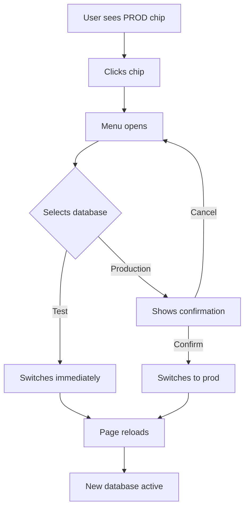

# Database Switcher UI Design

## Visual Layout

### AppBar with Database Switcher

```
┌────────────────────────────────────────────────────────────────────────┐
│  ☰  Recipes                                            [TEST] 🔍 👤    │
│     └─ Menu icon (mobile only)                         └─── switcher   │
└────────────────────────────────────────────────────────────────────────┘
```

### Switcher States

#### Production Mode (Red)
```
┌──────────┐
│ 🗄️ PROD  │  ← Red background (#f44336)
└──────────┘     White text
    Clickable chip
```

#### Test Mode (Green)
```
┌──────────┐
│ 🗄️ TEST  │  ← Green background (#4caf50)
└──────────┘     White text
    Clickable chip
```

### Dropdown Menu (Clicked)

```
┌──────────────────────┐
│ Select Database:     │
├──────────────────────┤
│ 🟢 Test              │ ← Currently selected
├──────────────────────┤
│ 🔴 Production        │
└──────────────────────┘
```

### Confirmation Dialog (Switching to Production)

```
┌─────────────────────────────────────────────────────┐
│  ⚠️  Switch to Production Database?                 │
├─────────────────────────────────────────────────────┤
│                                                      │
│  ⚠️ WARNING                                          │
│  You are about to switch to the PRODUCTION          │
│  database.                                           │
│                                                      │
│  Any changes you make will affect real data.        │
│  Make sure you've tested your changes on the        │
│  test database first.                               │
│                                                      │
│                         [Cancel] [Switch to Prod]   │
└─────────────────────────────────────────────────────┘
```

## Component Hierarchy

```
Layout
├── AppBar
│   ├── Toolbar
│   │   ├── MenuIcon (mobile)
│   │   ├── Typography (page title)
│   │   └── Box (marginLeft: 'auto')
│   │       └── DatabaseSwitcher ← NEW
│   │           ├── Chip (current database)
│   │           ├── Menu (database selection)
│   │           └── Dialog (confirmation)
```

## User Interaction Flow



## Responsive Behavior

### Desktop (>= 960px)
- Full label: "PROD" or "TEST"
- Positioned at far right of AppBar
- Large clickable target

### Mobile (< 960px)
- Same label: "PROD" or "TEST"
- Positioned before user icon (if present)
- Touch-friendly size (minimum 44x44px)

## Color Palette

| Database   | Primary Color | Hover Color | Text Color |
|-----------|---------------|-------------|------------|
| Production| `#f44336` (red) | `rgba(244,67,54,0.9)` | `#ffffff` |
| Test      | `#4caf50` (green) | `rgba(76,175,80,0.9)` | `#ffffff` |

## Accessibility

- **Keyboard Navigation**: Tab to focus, Enter/Space to activate
- **Screen Readers**: Announces "Database selector. Currently using [Production/Test]"
- **Focus Indicators**: Material-UI default focus ring
- **Color Contrast**: 4.5:1 ratio (white text on colored background)

## Edge Cases

1. **Invalid localStorage**: Falls back to production (safe default)
2. **Network Error**: Shows error message but keeps current selection
3. **Page Refresh**: Maintains selected database via localStorage
4. **Multiple Tabs**: Each tab can use different database independently

## Example Code Location References

- Component: [`recipe-planner/src/components/DatabaseSwitcher.tsx`](../recipe-planner/src/components/DatabaseSwitcher.tsx)
- Config: [`recipe-planner/src/lib/db-config.ts`](../recipe-planner/src/lib/db-config.ts)
- Integration: [`recipe-planner/src/components/Layout.tsx`](../recipe-planner/src/components/Layout.tsx) line ~183

