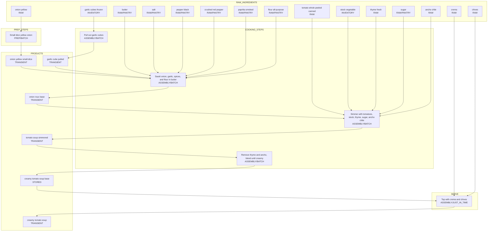

# Creamy Tomato Soup - Flow Diagram

## Recipe Type: meal

## Yield: 4 to 6 servings (about 8½ cups)

## Flow Diagram

## Notes

- **Stored product**: `creamy tomato soup base` — the finished blended soup is stored and reheated for serving.
- **Batch prep items**: Mincing onion, mincing garlic, sauté/roux, simmer, and blend are all done ahead — the soup keeps well.
- **Just-in-time**: Topping with crema and chives at serving time.
- **Pantry items**: butter, salt, pepper, crushed red pepper, smoked paprika, flour, sugar (not tracked in shopping lists).
- **Inventory items**: vegetable stock and frozen garlic cubes (the recipe's "garlic" comes from pre-made cubes, pulled out via an assembly step into `garlic cube (pulled)` transient).
- **Optional ingredient skipped**: grilled cheese is a separate dish served alongside, not modeled as part of this recipe.
- The ancho chile is added whole, then removed before blending. The recipe optionally allows blending in a portion of the deseeded chile for more smoky flavor — modeled as the simple "remove and blend" path here.
