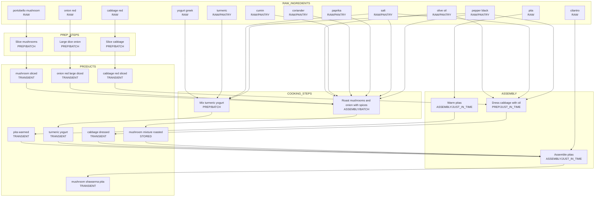

# Vegetarian Mushroom Shawarma Pitas - Flow Diagram

## Recipe Type: meal

## Yield: 1 quart container (stored mushroom mixture) + serves 4

## Flow Diagram

## Notes

- **Stored product**: The roasted mushroom mixture (`mushroom mixture roasted`) is stored in a 1 quart container
- **Batch prep items**: Slicing mushrooms, dicing onion, slicing cabbage, roasting, and turmeric yogurt can be done ahead
- **Just-in-time**: Dressing cabbage, warming pitas, and final assembly happen at serving time
- `onion red large diced` is an existing transient product
- Pantry items (olive oil, spices, salt, pepper) won't be tracked in shopping lists
